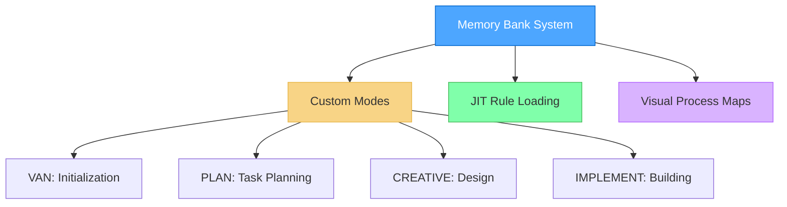
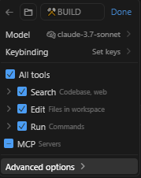
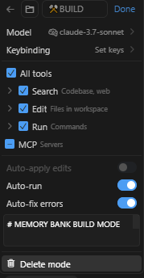
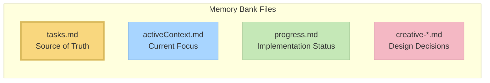

# Memory Bank System v0.6-beta

A modular, graph-based task management system that integrates with Cursor custom modes for efficient development workflows.



> **Development Status**: This system is actively under development. Features will be added and optimized over time. If you prefer stability over new features, you may continue using the previous version (v0.1-legacy), but please read about the architectural changes described in the [Memory Bank Upgrade Guide](memory_bank_upgrade_guide.md) to understand the benefits of this new approach.

## About Memory Bank

Memory Bank is a personal project that provides a structured approach to development using specialized modes for different phases of the development process. It uses a Just-In-Time (JIT) rule loading architecture that loads only the rules needed for each phase, optimizing context usage and providing tailored guidance.

### Beyond Basic Custom Modes

While Cursor's documentation describes custom modes as primarily standalone configurations with basic prompts and tool selections, Memory Bank significantly extends this concept:

- **Graph-Based Mode Integration**: Modes are interconnected nodes in a development workflow rather than isolated tools
- **Workflow Progression**: Modes are designed to transition from one to another in a logical sequence (VAN → PLAN → CREATIVE → IMPLEMENT)
- **Shared Memory**: Persistent state maintained across mode transitions via Memory Bank files
- **Adaptive Behavior**: Each mode adjusts its recommendations based on project complexity
- **Built-in QA Functions**: QA capabilities can be called from any mode for technical validation

This approach transforms custom modes from simple AI personalities into components of a coordinated development system with specialized phases working together.

### Isolated Rules Architecture

A key architectural change in v0.6-beta is the complete isolation of rules to custom modes:

- **No Global Rules**: Unlike the previous version, this system doesn't use global rules that affect all AI interactions
- **Mode-Specific Rules Only**: All rules are contained within their specific custom modes, with VAN serving as the entry point
- **Non-Interference**: When you're not using one of the Memory Bank custom modes, your regular Cursor usage remains completely unaffected by any Memory Bank customizations
- **Future-Proofing**: This isolation keeps the global rules space free and available for potential future features

This architectural change gives you much more control over when and how the Memory Bank system affects your Cursor experience.

### CREATIVE Mode and Claude's "Think" Tool

The CREATIVE mode in Memory Bank is conceptually based on Anthropic's Claude "Think" tool methodology, as described in their [engineering blog](https://www.anthropic.com/engineering/claude-think-tool). Key principles include:

- Structured exploration of design options
- Explicit documentation of pros and cons for different approaches
- Breaking complex problems into manageable components
- Systematic process to evaluate alternatives before making decisions
- Documentation of reasoning processes for future reference

For a detailed explanation of how Memory Bank implements these principles, including code examples and diagrams, see the [CREATIVE Mode and Claude's "Think" Tool](creative_mode_think_tool.md) document.

This implementation will continue to be refined and optimized as Claude's capabilities evolve, maintaining the core methodology while enhancing integration with the Memory Bank ecosystem.

## Key Features

- **Mode-Specific Visual Maps**: Clear visual representations for each development phase
- **Just-In-Time Rule Loading**: Load only the rules needed for your current task
- **Visual Decision Trees**: Guided workflows with clear checkpoints
- **Technical Validation**: QA processes that can be called from any mode
- **Platform-Aware Commands**: Automatically adapts commands to your operating system

## Installation Instructions

### Prerequisites

- **Cursor Editor**: Version 0.48 or higher is required.
- **Custom Modes**: Feature must be enabled in Cursor (Settings → Features → Chat → Custom modes).
- **AI Model**: Claude 3.7 Sonnet is recommended for best results, especially for CREATIVE mode's "Think" tool methodology. Other models may work, but their interpretations might vary, potentially requiring some trial and error.

### Step 1: Get the Files

Simply clone this repository into your project directory:

```
git clone https://github.com/vanzan01/memory-bank.git
```

Alternatively, you can download the ZIP file from GitHub and extract it to your project folder.

This provides you with all the necessary files, including:
- Rule files in `.cursor/rules/isolation_rules/`
- Mode instruction files in `custom_modes/` directory
- Template Memory Bank files in `memory-bank/`

### Step 2: Setting Up Custom Modes in Cursor

**This is the most critical and challenging part of the setup.** You'll need to manually create four custom modes in Cursor and copy the instruction content from the provided files:

#### How to Add a Custom Mode in Cursor

1. Open Cursor and click on the mode selector in the chat panel
2. Select "Add custom mode"
3. In the configuration screen:
   - Enter the mode name (you can include emoji icons like 🔍, 📋, 🎨, ⚒️ by copy-pasting them at the beginning of the name)
   - Select an icon from Cursor's limited predefined options (note: Cursor offers only a few basic icons, but you can use emoji in the name as a workaround)
   - Add a shortcut (optional)
   - Check the required tools
   - Click on **Advanced options**
   - In the empty text box that appears at the bottom, paste the custom instruction content from the corresponding file

<table>
  <tr>
    <td align="center"><em>Example configuration screen:</em></td>
    <td align="center"><em>Result in mode selection menu:</em></td>
  </tr>
  <tr>
    <td valign="top">
      
    </td>
    <td valign="top">
      
    </td>
  </tr>
</table>

#### Mode 1: VAN MODE (Initialization)

Configure as follows:
- **Name**: 🔍 VAN (copy-paste the magnifying glass emoji)
- **Icon**: Choose any available icon from Cursor's limited selection
- **Tools**: Enable "Codebase Search", "Read File", "Terminal", "List Directory"
- **Advanced options**: Paste the content from `custom_modes/van_instructions.md` in this repository into the text box at the bottom

#### Mode 2: PLAN MODE (Task Planning)

Configure as follows:
- **Name**: 📋 PLAN (copy-paste the clipboard emoji)
- **Icon**: Choose any available icon from Cursor's limited selection
- **Tools**: Enable "Codebase Search", "Read File", "Terminal", "List Directory"
- **Advanced options**: Paste the content from `custom_modes/plan_instructions.md` in this repository into the text box at the bottom

#### Mode 3: CREATIVE MODE (Design Decisions)

Configure as follows:
- **Name**: 🎨 CREATIVE (copy-paste the artist palette emoji)
- **Icon**: Choose any available icon from Cursor's limited selection
- **Tools**: Enable "Codebase Search", "Read File", "Terminal", "List Directory", "Edit File"
- **Advanced options**: Paste the content from `custom_modes/creative_instructions.md` in this repository into the text box at the bottom

#### Mode 4: IMPLEMENT MODE (Code Implementation)

Configure as follows:
- **Name**: ⚒️ IMPLEMENT (copy-paste the hammer and pick emoji)
- **Icon**: Choose any available icon from Cursor's limited selection
- **Tools**: Enable all tools
- **Advanced options**: Paste the content from `custom_modes/implement_instructions.md` in this repository into the text box at the bottom

For additional help on setting up custom modes in Cursor, refer to the [official Cursor documentation on custom modes](https://docs.cursor.com/chat/custom-modes).

### QA Functionality

QA is not a separate custom mode but rather a set of validation functions that can be called from any mode. You can invoke QA capabilities by typing "QA" in any mode when you need to perform technical validation. This approach provides flexibility to conduct verification at any point in the development process.

### File Structure Reference

After cloning, you'll have this directory structure:

```
your-project/
├── .cursor/
│   └── rules/
│       └── isolation_rules/
│           ├── Core/
│           ├── Level3/
│           ├── Phases/
│           │   └── CreativePhase/
│           ├── visual-maps/
│           │   └── van_mode_split/
│           └── main.mdc
├── memory-bank/
│   ├── tasks.md
│   ├── activeContext.md
│   └── progress.md
└── custom_modes/
    ├── van_instructions.md
    ├── plan_instructions.md
    ├── creative_instructions.md
    ├── implement_instructions.md
```

## Basic Usage

1. **Start with VAN Mode**:
   - Switch to VAN mode in Cursor
   - Type "VAN" to initiate the initialization process
   - VAN will analyze your project structure and determine complexity

2. **Follow the Workflow Based on Complexity**:
   - **Level 1 tasks**: May proceed directly to IMPLEMENT after VAN
   - **Level 2-4 tasks**: Follow the full workflow (VAN → PLAN → CREATIVE → IMPLEMENT)
   - **At any point**: Type "QA" to perform technical validation

3. **Mode-Specific Commands**:
   ```
   VAN - Initialize project and determine complexity
   PLAN - Create detailed implementation plan
   CREATIVE - Explore design options for complex components
   IMPLEMENT - Systematically build planned components
   QA - Validate technical implementation (can be called from any mode)
   ```

## Core Files and Their Purposes



- **tasks.md**: Central source of truth for task tracking
- **activeContext.md**: Maintains focus of current development phase
- **progress.md**: Tracks implementation status
- **creative-*.md**: Design decision documents generated during CREATIVE mode

## Troubleshooting

### Common Issues

1. **Mode not responding correctly**:
   - Verify custom instructions were copied completely (this is the most common issue)
   - Ensure the correct tools are enabled for each mode
   - Check that you've switched to the correct mode before issuing commands
   - Make sure you pasted the instructions in the "Advanced options" text box

2. **Rules not loading**:
   - Make sure the `.cursor/rules/isolation_rules/` directory is in the correct location
   - Verify file permissions allow reading the rule files

3. **Command execution issues**:
   - Ensure you're running commands from the correct directory
   - Verify platform-specific commands are being used correctly

## Version Information

This is version v0.6-beta of the Memory Bank system. It's designed for new projects and experimental use. There is no formal migration path from the legacy version (v0.1-legacy), so it's recommended to start fresh with new projects.

### Ongoing Development

The Memory Bank system is actively being developed and improved. Key points to understand:

- **Work in Progress**: This is a beta version with ongoing development. Expect regular updates, optimizations, and new features.
- **Feature Optimization**: The modular architecture enables continuous refinement without breaking existing functionality.
- **Previous Version Available**: If you prefer the stability of the previous version (v0.1-legacy), you can continue using it while this version matures.
- **Architectural Benefits**: Before deciding which version to use, please read the [Memory Bank Upgrade Guide](memory_bank_upgrade_guide.md) to understand the significant benefits of the new architecture, including improved context efficiency, visual guidance, and mode-specific optimization.

## Developer Notes

This is a personal hobby project that brings me joy to build and develop. I welcome feedback and suggestions for improvement. The system is designed for experimentation and may evolve significantly based on user experiences.

## Resources

- [Cursor Custom Modes Documentation](https://docs.cursor.com/chat/custom-modes)
- [Memory Bank Upgrade Guide](memory_bank_upgrade_guide.md)
- [CREATIVE Mode and Claude's "Think" Tool](creative_mode_think_tool.md)
- Mode-specific instruction files in the `custom_modes/` directory

---

*Note: This README is for v0.6-beta and subject to change as the system evolves.* 