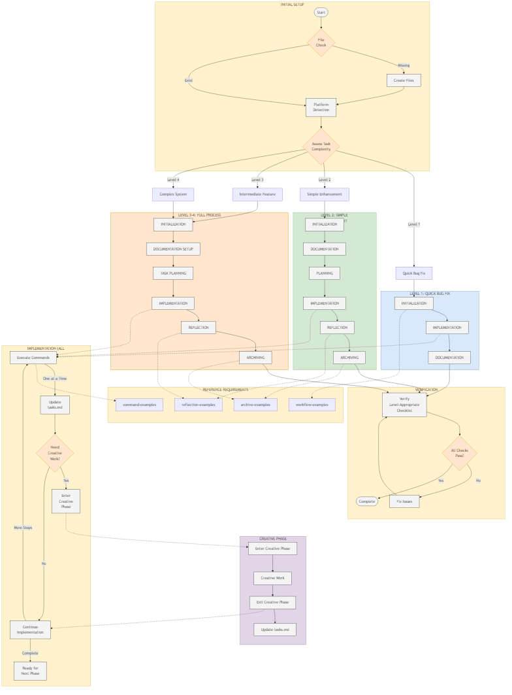

# Cursor Memory Bank System

[](https://opensource.org/licenses/MIT)

> **Give your AI assistant a memory that persists between sessions**

## The Problem: AI Assistants Keep Forgetting

Every developer who works with AI assistants faces the same frustration: **your AI helper forgets everything between sessions**. You spend time explaining your project, walking through architecture decisions, and establishing conventions - only to have that context disappear when you close your editor.

This fundamental limitation of Large Language Models (LLMs) creates several challenges:

- **Lost Context**: Every new session starts from scratch
- **Repeated Explanations**: You constantly re-explain your project basics
- **Inconsistent Implementations**: Solutions vary as context is lost
- **Documentation Drift**: Project knowledge exists only in your head

## Our Solution: A Memory System That Works

The Cursor Memory Bank System creates a **structured external memory** for your AI assistant using Cursor's powerful rules system. Rather than overwhelming the LLM with massive context dumps (which often get partially processed), our approach strategically organizes documentation into purpose-built files that are:

- **Selectively Loaded**: Only relevant context is accessed when needed
- **Automatically Maintained**: The system updates its own memory
- **Procedurally Verified**: Built-in checkpoints ensure completeness
- **Platform-Aware**: Adapts to your operating system automatically
- **Adaptive Complexity**: Scales process based on task complexity
- **Creative Phase Enforcement**: Ensures proper design thinking for complex tasks



## How It Works: Strategic Context Management

The Memory Bank System solves the context limitations of LLMs through these key innovations:

### 1. Structured Documentation as Memory

Instead of trying to pack everything into a single context window, we create a network of specialized documentation files that serve as the AI's long-term memory:

```
memory-bank/
├── projectbrief.md      # What we're building
├── productContext.md    # Why we're building it
├── activeContext.md     # What we're working on now
├── systemPatterns.md    # How we've designed it
├── techContext.md       # What technologies we're using
├── progress.md          # What we've completed
└── tasks.md             # What we're tracking (single source of truth)
```

### 2. Rule-Based Context Loading

We leverage Cursor's rules system to selectively load only the most relevant context when needed:

- **Always-Applied Rules**: Critical system functions that guide every interaction
- **Auto-Attached Rules**: Context that loads only when working in specific directories
- **Agent-Requested Rules**: Detailed information the AI explicitly requests when needed

This strategic loading prevents context window overflow while ensuring the AI has access to all knowledge.

### 3. Adaptive Workflow Enforcement

The system scales its workflow process based on task complexity:

- **Level 1: Quick Bug Fix** - Streamlined process for simple errors and minor issues
- **Level 2: Simple Enhancement** - Basic process for small features and improvements
- **Level 3: Intermediate Feature** - Standard process for complete features with required creative phases
- **Level 4: Complex System** - Comprehensive process for major architectural changes with enforced creative phases

Each level provides appropriate documentation rigor and process structure to match the task requirements.

### 4. Enhanced Creative Phase System

Inspired by Anthropic's "Think Tool" approach (see [Think Tool by Anthropic](https://www.anthropic.com/engineering/claude-think-tool)), our latest updates incorporate a powerful creative phase system:

- **Enforced Design Thinking**: Hard gateways prevent implementation without proper creative phases
- **Structured Problem Exploration**: Systematic breakdown of complex problems
- **Option Analysis Framework**: Weighted decision matrices for evaluating alternatives
- **Quality Metrics**: Objective evaluation criteria for design decisions
- **Verification Processes**: Systematic validation against requirements

This ensures that complex architectural and design decisions receive proper consideration before implementation begins.

## The Benefits: A Truly Persistent AI Partner

By implementing the Memory Bank System, you gain:

- **Session Persistence**: Your AI retains critical context between sessions
- **Self-Documenting Projects**: Documentation automatically stays up to date
- **Workflow Efficiency**: Process scales to match task complexity
- **Platform Adaptability**: Commands automatically adapt to your OS
- **Reduced Cognitive Load**: Stop repeating yourself and focus on building
- **Better Design Decisions**: Enhanced creative phases lead to more robust implementations

## The "VAN" Experience: Instant Productivity

Getting started on any task is as simple as typing "VAN" followed by what you need:

```
User: VAN I need to create a new API endpoint for user authentication

AI: OK VAN

I'll check for the critical files:

## FILE VERIFICATION
[X] .cursorrules - exists
[X] memory-bank directory - exists
[X] docs/archive directory - exists

## INITIALIZATION
Task: Create API Endpoint for User Authentication
Objective: Implement secure endpoint for authenticating users

I'll begin by reviewing the Memory Bank files to understand our current architecture...
```

The AI assistant immediately understands what you need, verifies the system files, and begins a structured workflow - with full awareness of your project's context from previous sessions.

## Getting Started: Installation Guide

Setting up the Memory Bank System takes just minutes:

1. **Clone this repository** into your project
```bash
# Clone the Memory Bank System
git clone https://github.com/vanzan01/cursor-memory-bank.git
```

2. **Set up the rule structure in your project**

Cursor's new rule format uses a `.cursor/rules` folder structure for organizing custom rules. You need to:

- Copy the entire `.cursor/rules` folder from this repository to your project
- If you already have a `.cursor/rules` folder in your project, you'll need to copy the required rules from this repository into your existing folder

3. **Configure User Rules in Cursor**

You still need to add the global rules to Cursor's User Rules section:

- **Copy the global-rules.md content**: The file contains essential instructions for the AI assistant to follow
- **Open Cursor Settings**: Click on the gear icon in the bottom left or use keyboard shortcut Ctrl+, (Windows/Linux) or Cmd+, (Mac)
- **Navigate to User Rules**: Go to Cursor Settings > Rules > User Rules (editable section)
- **Paste the global-rules.md content**: Copy and paste the entire content of global-rules.md into the User Rules text box
- **Save your settings**: Click "Save" or "Apply" to activate the rules

4. **Verify your configuration**
- Go to Cursor > Rules
- Scroll to the bottom
- You should see all your configured rules listed there

5. **Initialize the system** with a simple "VAN" command
6. **Start using your AI** with persistent memory

This manual setup is necessary as Cursor requires User Rules to be explicitly added to the settings. Once added, the Memory Bank system will be active and ready to use with the "VAN" command.

## What's New in the Latest Version

Our latest optimization rounds (7 and 8) have significantly enhanced the Memory Bank System with a focus on ensuring quality decision-making for complex tasks:

### Optimization Round 7: Structured Creative Thinking

- **Mandatory Creative Phases**: No longer optional for Level 3-4 tasks
- **Structured Thinking Framework**: Systematic problem breakdown with verification steps
- **Task Planning Integration**: Creative phase planning explicitly incorporated into workflow
- **Enhanced Verification**: Creative phase checks added to all checkpoints
- **Domain-Specific Templates**: Specialized templates for different design challenges

### Optimization Round 8: Creative Phase Enforcement & Metrics

- **Hard Gateway Implementation**: Strict enforcement prevents skipping design phases
- **Workflow Structure Enhancement**: Creative phases now an explicit workflow step
- **Enhanced Checkpoint System**: Dedicated creative phase checkpoints before implementation
- **Quality Metrics Framework**: Objective evaluation criteria for design decisions
- **Structured Evaluation Tools**: Decision quality scoring with minimum thresholds

These enhancements were inspired by Anthropic's "Think Tool" concept, which provides AI assistants with dedicated thinking space for complex problem-solving.

## Understanding the Technical Foundation

### The Context Window Challenge

LLMs have a fundamental limitation: they can only "see" a limited amount of text at once (the context window). When this window is full, older information gets pushed out and forgotten.

Traditional approaches try to solve this by:

1. **Cramming everything in** - Which overwhelms the model and leads to partial processing
2. **Summarizing content** - Which loses critical details 
3. **RAG systems** - Which require extensive setup and maintenance

The Memory Bank takes a different approach by creating a **structured external memory system** that the AI can selectively access and update. This means:

- Only relevant rules are loaded into context when needed
- Details are extracted to reference files that are explicitly consulted
- Core rules remain concise for maximum processing efficiency

### Cursor's Rules System: The Perfect Platform

This system leverages Cursor's unique rules architecture to implement intelligent context management:

```markdown
---
description: Command execution protocol
globs: "**/src/**", "**/.cursorrules"
alwaysApply: false
---
```

Rules can be:
- Applied globally to guide all interactions
- Attached to specific file patterns
- Referenced explicitly when detailed information is needed

This creates a layered memory system that mitigates context limitations while maintaining comprehensive project knowledge.

## Frequently Asked Questions

**Q: Will this work with any LLM?**  
A: The Memory Bank System is specifically designed for Cursor's AI assistant and rules system.

**Q: Does this require constant maintenance?**  
A: No! The system automatically maintains itself through the built-in workflow.

**Q: Is this complicated to set up?**  
A: Setup takes less than 5 minutes with our simple initialization process.

**Q: Does this slow down my workflow?**  
A: The opposite! After initial setup, you'll save time by not having to repeatedly explain your project.

**Q: How does the creative phase system work?**  
A: For complex tasks (Level 3-4), the system enforces dedicated thinking space for design decisions before implementation begins. This follows principles similar to Anthropic's "Think Tool" concept, ensuring thorough exploration of options before coding starts.

## Detailed Documentation

For more detailed information about the Memory Bank System:

- [Complete Architecture](./docs/architecture.md) - Comprehensive technical details
- [Optimization Journey](./docs/optimization-journey.md) - How the system evolved through 8 iterations
- [Creative Phase Examples](./.cursor/rules/Extended%20Details/creative-phase-examples.mdc) - Examples of different creative phase types

## Join the Memory Revolution

Stop accepting that your AI assistant forgets everything. With the Cursor Memory Bank System, you can finally have a truly persistent AI development partner.

[Get Started Now](#getting-started) | [View on GitHub](https://github.com/vanzan01/cursor-memory-bank) | [Report Issues](https://github.com/vanzan01/cursor-memory-bank/issues)

---

# Technical Documentation

The following sections provide detailed technical information for implementing and customizing the Memory Bank System. These details are primarily relevant for advanced users or those looking to make modifications to the system.

## 📋 Core Design Principles

1. **Documentation as Memory**: Documentation serves as mission-critical infrastructure
2. **Strategic Content Organization**: Balance between cohesive main files and extracted details
3. **Mandatory Verification Steps**: Explicit section checkpoints prevent steps from being skipped
4. **Single Source of Truth**: tasks.md as the authoritative source for task status tracking
5. **Platform Awareness**: Commands adapted for specific operating systems
6. **Real-Time Documentation**: Implementation details continuously added to activeContext.md
7. **Adaptive Complexity**: Process scales based on task requirements from simple bug fixes to complex systems
8. **Creative Phase Enforcement**: Hard gateways ensure proper design thinking for complex tasks
9. **Objective Quality Metrics**: Structured evaluation frameworks for decision quality

## 🚀 Implementation Guide

### Setup Steps

1. **Global Rules Configuration**
   - In Cursor Settings > General > Rules for AI, add the Global Rules content
   - This serves as the foundation for the entire Memory Bank System

2. **Directory Structure Creation**
   ```
   .cursor/
   └── rules/
       ├── main.mdc                      # Master control file with references
       ├── system-overview.mdc           # High-level system overview
       │
       ├── Core Implementation/          # Core rule implementations
       │   ├── creative-phase-enforcement.mdc   # Hard enforcement mechanisms
       │   ├── creative-phase-metrics.mdc       # Quality metrics framework
       │   └── [other core files]              # Additional implementation files
       │
       ├── Extended Details/             # Detailed examples and references
       │   ├── creative-phase-examples.mdc      # Example creative phases
       │   └── [other example files]           # Additional example files
       │
       └── Templates/                    # Document templates
   
   Project Root:
   ├── memory-bank/                # Primary memory storage
   │   ├── projectbrief.md         # Project requirements and goals
   │   ├── productContext.md       # Why this project exists
   │   ├── activeContext.md        # Current work focus
   │   ├── systemPatterns.md       # Architecture patterns
   │   ├── techContext.md          # Technologies used
   │   ├── progress.md             # Implementation status
   │   └── tasks.md                # SINGLE SOURCE OF TRUTH for task tracking
   ├── .cursorrules                # Project-specific patterns
   └── docs/
       └── archive/
           └── completed_tasks.md  # Archived completed tasks
   ```

3. **Core Files Implementation**
   - Create all files in the Core Implementation directory
   - Each file should follow the standardized format with TL;DR summary at the top

4. **Extended Details Creation**
   - Add detailed examples in the Extended Details directory
   - These serve as reference files that are explicitly consulted during implementation

5. **Memory Bank Template Setup**
   - Create the initial Memory Bank directory structure
   - Populate with templates for all required files

6. **Reference Triggers Setup**
   - Ensure all reference triggers are established in core files
   - These force documentation consultation at critical points

## 📜 Rule Types & Application Patterns

The system utilizes three distinct rule types, each with specific application patterns:

### 1. Always-Applied Rules
```markdown
---
description: 
globs: 
alwaysApply: true
---
```
- Applied to every command regardless of context
- Used for critical rules that must be followed in all situations
- Kept concise to minimize context window usage
- Examples: main.mdc, verification-checklist.mdc

### 2. Auto-Attached Rules
```markdown
---
description: 
globs: "**/memory-bank/**", "**/.cursorrules"
alwaysApply: false
---
```
- Automatically applied when working with matching file patterns
- Used for context-specific rules that only apply in certain situations
- Can be more detailed since they're only loaded when relevant
- Examples: memory-bank.mdc, task-tracking.mdc

### 3. Agent-Requested Rules
```markdown
---
description: CRITICAL: Contains mandatory examples for correct workflow implementation. DO NOT assume patterns without consulting this documentation.
globs: "**/src/**"
alwaysApply: false
---
```
- Agent explicitly instructed to read these files before proceeding
- Used for detailed examples, extended explanations, and verbose content
- Helps manage context window by moving details out of main files
- Examples: workflow-examples.mdc, command-examples.mdc

## 🛠️ Best Practices

1. **Keep Core Files Concise**
   - Core files should be 200-300 lines maximum
   - Move detailed examples to Extended Details files

2. **Use Appropriate Rule Types**
   - Select the right rule type for each file's purpose
   - Apply alwaysApply: true only for critical rules

3. **Maintain Clear Directory Structure**
   - Keep the established directory organization
   - Place new rules in the appropriate category

4. **Document Reference Relationships**
   - Clearly indicate which files reference others
   - Use the standardized reference check format

5. **Prioritize Platform Awareness**
   - Ensure commands are adaptable to different operating systems
   - Document platform-specific considerations in techContext.md

6. **Enforce Single Source of Truth**
   - Always update task status only in tasks.md
   - Refer to this file for all task tracking needs

7. **Match Process to Complexity**
   - Use the appropriate workflow level for each task
   - Scale documentation rigor based on task requirements

## 🚧 Common Implementation Challenges

1. **Missing Section Headers**: Always use all six mandatory section headers in exact order
2. **Incorrect Task Status Tracking**: Update task status only in tasks.md (Single Source of Truth)
3. **Skipped Verification**: Always run the verification checklist before completing any task
4. **Template Text Remnants**: Always remove template/placeholder text in archive files
5. **Command Chaining**: Always execute commands one at a time, never chained
6. **.cursorrules as Directory**: Creating .cursorrules as a directory instead of a file

## 🧩 Advanced Features

### Adaptive Complexity Levels
```
The system scales across four complexity levels:

1. **Level 1: Quick Bug Fix**
   - Simple errors, UI glitches, minor issues
   - Streamlined process with targeted documentation
   - 2-3 task updates (start/fix/end)
   - Focus: Fix the specific issue

2. **Level 2: Simple Enhancement**
   - Small features, minor improvements
   - Basic process with essential documentation
   - 4-6 task updates at key milestones
   - Focus: Clean implementation with clear documentation

3. **Level 3: Intermediate Feature**
   - Complete features, significant changes
   - Standard process with full section tracking
   - 8-12 task updates at defined points
   - Focus: Comprehensive planning and documentation

4. **Level 4: Complex System**
   - Major systems, architectural changes
   - Full formal process with detailed checkpoints
   - 15+ task updates with formal verification
   - Focus: Architectural integrity and complete documentation
```

### Enhanced Verification System
```
✓ SECTION CHECKPOINT: [SECTION NAME]
- Requirement 1? [YES/NO]
- Requirement 2? [YES/NO]
- Requirement 3? [YES/NO]
- Section tracking updated to [X]? [YES/NO]

→ If all YES: Ready for next section
→ If any NO: Fix missing items before proceeding
```

### Standardized Reference Checks
```
📚 REFERENCE CHECK:
- CONSULTING: [file name]
- PURPOSE: [specific reason for consulting]
- CRITICAL ELEMENTS: [key items to look for]

Key insights:
- [Key insight 1]
- [Key insight 2]
- [Key insight 3]

✓ Reference consultation complete
```

### Real-Time Task Updates
```
🔄 TASK UPDATE: [Task/Subtask] - [X] Complete/[ ] Pending
- Updated in tasks.md ✓

🔄 IMPLEMENTATION UPDATE:
- Added to activeContext.md: [Brief implementation details]
```

### Creative Phase Handling
```
======== ENTERING CREATIVE PHASE ========

======== EXITING CREATIVE PHASE - UPDATING TASKS ========
```

### Platform-Specific Command Adaptations
The system automatically adapts commands based on the detected operating system:

**Windows Command Format:**
```bash
echo. > .cursorrules            # Create file
mkdir memory-bank               # Create directory
```

**Mac/Linux Command Format:**
```bash
touch .cursorrules              # Create file
mkdir -p memory-bank            # Create directory
```

### Section Transition Markers
Visual indicators for workflow progression:
```
======== INITIALIZATION COMPLETE ⟹ STARTING DOCUMENTATION SETUP ========
```

### Comprehensive Reflection Format
Every task includes a structured reflection with four sections:
1. What Went Well (≥3 items)
2. Challenges (≥2 items)
3. Lessons Learned (≥3 items)
4. Improvements for Next Time (≥3 items)

### Archive Cross-Linking
Tasks are archived with cross-references to maintain traceability:
```markdown
## Completed Tasks
- [Task Name] - Completed on YYYY-MM-DD, see [archive entry](mdc:../docs/archive/completed_tasks.md#task-task-name-v10)
```

## 📦 Requirements

- **Cursor IDE**: This system is designed specifically for implementation in the Cursor IDE
- **Rules Configuration**: Ability to configure IDE rules for AI assistants
- **Project Structure**: Consistent directory structure as specified
- **Documentation Commitment**: Understanding that documentation is mission-critical infrastructure

## 📄 License

This project is licensed under the MIT License - see the LICENSE file for details.

## 🤝 Contributing

Contributions to improve the Memory Bank System are welcome. Please adhere to the following guidelines:
1. Maintain the core design principles
2. Follow the established file structure
3. Document any changes comprehensively
4. Test changes across multiple operating systems

## 📞 Support

If you encounter issues implementing the Memory Bank System, please:
1. Check the Common Implementation Challenges section
2. Review the Best Practices
3. Ensure all required files exist in the specified structure
4. Verify rule configurations are correct

## 🙏 Acknowledgments

This architecture is designed to optimize AI assistant capabilities within the Cursor IDE, creating a truly persistent development partner that can adapt to any operating system and maintain clear documentation through a structured workflow that scales with task complexity.

Special thanks to:
- [@ipenywis](https://gist.github.com/ipenywis) for their contributions to memory systems for AI assistants
- [Cursor Memory Bank Gist](https://gist.github.com/ipenywis/1bdb541c3a612dbac4a14e1e3f4341ab) which provided valuable insights for this implementation 