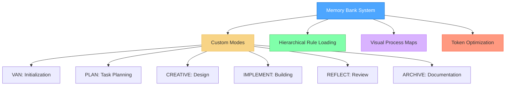
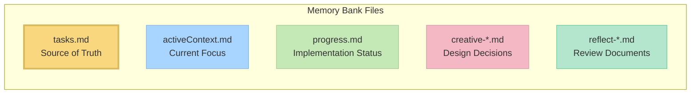

# Trae 版本的 Memory Bank System v0.7-beta

本项目为 [https://github.com/vanzan01/cursor-memory-bank](https://github.com/vanzan01/cursor-memory-bank) 项目的Trae版本，本项目进行了如下改动：
1. 使用AI把说明文档修改为Trae版本并做了翻译，把一些概念从cursor迁移到trae，如：
   - custom mode --> 自定义智能体
2. 对原项目提供的prompt进行了删减，因为Trae的自定义智能体有10000字符的提示词限制。

> **Note**: 此项目提供系统提示词非常长，注意Tokens消耗。

Memory Bank是一个针对令牌优化的分层任务管理系统，使用Trae的自定义Agent，旨在提升开发工作流程的效率。



> **Personal Note**: Memory Bank 是我为个人编码项目开发的爱好项目。由于这是个人项目，我不维护问题跟踪器或主动收集反馈。然而，如果您在使用这些规则时遇到问题，其中一个很大的优势是您可以直接请求 Cursor AI 修改或更新规则，以更好地适应您的特定工作流程。该系统旨在由 AI 进行适应，使您无需外部支持即可根据自己的需求进行定制。

## 关于 Memory Bank

Memory Bank 提供了一种结构化的开发方法，使用专门的模式来处理开发过程的不同阶段。它采用分层规则加载架构，仅加载每个阶段所需的规则，从而优化令牌使用并提供量身定制的指导。

### Token-Optimized Architecture

0.7-beta 引入了显著的 Token-Optimized 改进：

- **Hierarchical Rule Loading**: 采用特制的延迟加载机制，仅初始加载必要的规则
- **Progressive Documentation**: 实现简洁的模板，随着任务复杂度的增加而扩展
- **Optimized Mode Transitions**: 在模式之间高效地保留关键上下文
- **Level-Specific Workflows**: 根据任务复杂度调整文档需求


有关所有优化方法的详细信息，请参阅 [Memory Bank Optimizations](MEMORY_BANK_OPTIMIZATIONS.md) 文档。

### Beyond Basic Custom Modes

虽然 Trae的[自定义智能体](https://docs.trae.ai/ide/agent?_lang=zh)可以新建一个自定义系统提示词和工具的智能体，但 Memory Bank 扩展了这一概念：

- **Graph-Based Mode Integration**: 每个自定义智能体是开发工作流程中相互连接的节点，而不是孤立的工具
- **Workflow Progression**: 自定义智能体设计为按逻辑顺序从一个过渡到另一个（VAN → PLAN → CREATIVE → IMPLEMENT → REFLECT → ARCHIVE）
- **Shared Memory**: 通过 Memory Bank 文件在模式转换之间维护持久状态
- **Adaptive Behavior**: 每种自定义智能体根据项目复杂度调整其建议
- **Built-in QA Functions**: 可以从任何模式调用 QA 功能进行技术验证

这种方法将自定义智能体转变为协调开发系统的组件，各个专门的阶段协同工作。

### CREATIVE 智能体 与 Claude 的 "Think" 工具

Memory Bank 中的 CREATIVE智能体 在概念上基于 Anthropic 的 Claude "Think" 工具方法，如其 [工程博客](https://www.anthropic.com/engineering/claude-think-tool)中所述。v0.7-beta 实现了一个优化版本，具有：

- 带有表格选项比较的渐进式文档
- "Detail-on-demand" 方法，保持token效率
- 随着复杂度扩展的结构化模板
- 为实现阶段高效地保留上下文 

有关 Memory Bank 如何实现这些原则的详细说明，请参阅[CREATIVE Mode and Claude's "Think" Tool](creative_mode_think_tool.md) 文档.

## 主要功能

- **Hierarchical Rule Loading**: 仅使用特制的延迟加载机制加载必要的规则
- **Progressive Documentation**: 简洁的模板，随着任务复杂度的增加而扩展
- **Unified Context Transfer**: 在模式之间高效地保留上下文
- **Mode-Specific Visual Maps**: 每个开发阶段的清晰可视化表示
- **Level-Specific Workflows**: 根据复杂度（级别 1-4）调整的流程
- **Platform-Aware Commands**: 自动将命令适应您的操作系统

## 安装说明

### 先决条件

- **Trae Editor**: 使用最新版本。
- **AI Model**: 建议使用 Claude 3.7 Sonnet，以获得最佳效果，特别是在 CREATIVE 智能体中使用 "Think"。

### 第一步：获取文件

只需将此存储库克隆到您的项目目录中：

```
git clone https://github.com/vanzan01/cursor-memory-bank.git
```

或者，您可以从 GitHub 下载 ZIP 文件并将其解压到您的项目文件夹中。
这将为您提供所有必要的文件，包括：
- `.cursor/rules/isolation_rules/` 中的规则文件
- `custom_modes/` 目录中的自定义智能体的prompt文件
- `memory-bank/` 中的 Memory Bank 模板文件

### 第二步：在 Trea 中设置自定义智能体
**这篇文档里这是最关键的部分。** 您需要在 Trae里 中手动创建六个自定义智能体，并从提供的文件中复制prompt：

#### 如何在Trae里添加自定义智能体

1. 打开 Trae，点击聊天面板中的⚙️图标，然后选择 "智能体"
2. 点击 "创建"，创建一个自定义智能体
3. 在配置选项中：
   - 输入智能体名称（您可以在名称开头复制粘贴表情符号，如 🔍、📋、🎨、⚒️）
   - “提示词“选项卡中，粘贴对应模式的提示词内容
   - 勾选所需的工具
   - 点击创建

#### 智能体配置

为每个智能体进行如下配置：

1. **VAN 智能体** （初始化）
   - **名称**: 🔍 VAN
   - **工具**: 启用 "File system", "Terminal"
   - **提示词**: 从 `custom_modes/van_instructions.md` 黏贴

2. **PLAN 智能体** （任务规划）
   - **名称**: 📋 PLAN
   - **工具**: 启用 "File system", "Terminal"
   - **提示词**: 从 `custom_modes/plan_instructions.md` 黏贴

3. **CREATIVE 智能体** (设计决策)
   - **名称**: 🎨 CREATIVE
   - **工具**: 启用 "File system", "Terminal"
   - **提示词**: 从 `custom_modes/creative_instructions.md` 黏贴

4. **IMPLEMENT MODE** (代码实现)
   - **名称**: ⚒️ IMPLEMENT
   - **工具**: 启用 "File system", "Terminal"
   - **提示词**: 从 `custom_modes/implement_instructions.md` 黏贴

5. **REFLECT MODE** (审查)
   - **名称**: 🔍 REFLECT
   - **工具**: 启用 "File system", "Terminal"
   - **提示词**: 从 `custom_modes/reflect_archive_instructions.md` (REFLECT section) 黏贴
   
6. **ARCHIVE MODE** (审查)
   - **名称**: 📚 ARCHIVE
   - **工具**: 启用 "File system", "Terminal"
   - **提示词**: 从 `custom_modes/reflect_archive_instructions.md` (ARCHIVE section) 黏贴

> 注意：REFLECT 和 ARCHIVE 指令合并在一个文件中，以优化 Cursor 的字符限制

### QA 功能

QA（质量保证）不是一个独立的自定义模式，而是一组可以从任何模式中调用的验证函数。您可以在任何模式中键入 “QA” 来执行技术验证。这种方式提供了在开发过程的任何阶段进行验证的灵活性。

## 基本使用

1. **从 VAN 智能体开始：**
   - 在Trae的聊天框里选择 VAN 智能体
   - 输入命令 "VAN" 开始初始化过程
   - VAN 智能体将分析您的项目结构并确定复杂性

2. **根据复杂度遵循工作流程：**
   - **Level 1 tasks**: 可以在 VAN 之后直接进入 IMPLEMENT
   - **Level 2 tasks**: 简化流程（VAN → PLAN → IMPLEMENT → REFLECT）
   - **Level 3-4 tasks**: 完整流程（VAN → PLAN → CREATIVE → IMPLEMENT → REFLECT → ARCHIVE）
   - **At any point**: 输入 “QA” 可执行技术验证

3. **Mode-Specific Commands**:
   ```
   VAN - 初始化项目并评估复杂度
   PLAN - 创建详细的实现计划
   CREATIVE - 探索复杂组件的设计方案
   IMPLEMENT - 按计划系统性地构建组件
   REFLECT - 回顾并记录所学经验
   ARCHIVE - 编写完整的项目文档
   QA - 验证技术实现（可在任意模式中调用）
   ```

## 核心文件与作用



- **tasks.md**: 任务追踪的主数据源
- **activeContext.md**: 记录当前开发阶段的聚焦内容
- **progress.md**: 跟踪任务的实现进度
- **creative-*.md**: CREATIVE 模式生成的设计文档
- **reflect-*.md**: REFLECT 模式生成的回顾记录

## 故障排除

### 常见问题


1. *智能体响应不正常：**
   - 检查自定义指令是否完整复制（这是最常见的问题）
   - 确保每个模式启用了正确的工具
   - 确保在发出命令前切换到了对应智能体
   - 确保指令粘贴在“提示词”文本框中

2. **规则未加载：**
   - 检查 `.cursor/rules/isolation_rules/` 是否放置在正确位置
   - 检查文件权限，确保允许读取

3. **命令执行失败**:
   - 确保您在正确的目录中运行命令
   - 检查是否使用了针对平台的正确命令（如 Windows/Linux）

## 原项目版本信息

This is version v0.7-beta of the Memory Bank system. It introduces significant token optimization improvements over v0.6-beta while maintaining all functionality. See the [Release Notes](RELEASE_NOTES.md) for detailed information about the changes.

### Ongoing Development

The Memory Bank system is actively being developed and improved. Key points to understand:

- **Work in Progress**: This is a beta version with ongoing development. Expect regular updates, optimizations, and new features.
- **Feature Optimization**: The modular architecture enables continuous refinement without breaking existing functionality.
- **Previous Version Available**: If you prefer the stability of the previous version (v0.1-legacy), you can continue using it while this version matures.
- **Architectural Benefits**: Before deciding which version to use, please read the [Memory Bank Upgrade Guide](memory_bank_upgrade_guide.md) to understand the significant benefits of the new architecture.

## 相关文档

- [Memory Bank Optimizations](MEMORY_BANK_OPTIMIZATIONS.md) - Detailed overview of token efficiency improvements
- [Release Notes](RELEASE_NOTES.md) - Information about the latest changes
- [Cursor Custom Modes Documentation](https://docs.cursor.com/chat/custom-modes)
- [Memory Bank Upgrade Guide](memory_bank_upgrade_guide.md)
- [CREATIVE Mode and Claude's "Think" Tool](creative_mode_think_tool.md)
- Mode-specific instruction files in the `custom_modes/` directory

---

*Note: This README is for v0.7-beta and subject to change as the system evolves.*