# CREATIVE Mode and Claude's "Think" Tool

This document explains how Memory Bank's CREATIVE mode implements concepts similar to Anthropic's Claude "Think" tool methodology, as described in their [engineering blog](https://www.anthropic.com/engineering/claude-think-tool).

## Conceptual Parallels

The following diagram illustrates the conceptual similarities between Claude's "Think" tool methodology and Memory Bank's CREATIVE mode:

```mermaid
graph TD
    subgraph "Claude Think Tool Approach"
        CT1["1: Decompose Problem"] --> CT2["2: Explore Solution Space"]
        CT2 --> CT3["3: Analyze Trade-offs"]
        CT3 --> CT4["4: Select & Document Decision"]
        CT4 --> CT5["5: Validate Decision"]
    end
    
    subgraph "Memory Bank CREATIVE Mode"
        CM1["1: Component Breakdown"] --> CM2["2: Option Exploration"]
        CM2 --> CM3["3: Trade-off Analysis"]
        CM3 --> CM4["4: Decision Documentation"]
        CM4 --> CM5["5: Decision Verification"]
    end
    
    style CT1 fill:#f9d77e,stroke:#d9b95c
    style CT2 fill:#f9d77e,stroke:#d9b95c
    style CT3 fill:#f9d77e,stroke:#d9b95c
    style CT4 fill:#f9d77e,stroke:#d9b95c
    style CT5 fill:#f9d77e,stroke:#d9b95c
    
    style CM1 fill:#a8d5ff,stroke:#88b5e0
    style CM2 fill:#a8d5ff,stroke:#88b5e0
    style CM3 fill:#a8d5ff,stroke:#88b5e0
    style CM4 fill:#a8d5ff,stroke:#88b5e0
    style CM5 fill:#a8d5ff,stroke:#88b5e0
```



## Core Principles of Claude's "Think" Tool

Claude's "Think" tool methodology centers around:

1. **Structured Thinking Process**: Breaking down complex problems into manageable components
2. **Explicit Reasoning**: Clearly documenting the reasoning process
3. **Option Exploration**: Systematically exploring multiple solution approaches
4. **Trade-off Analysis**: Weighing pros and cons of different options
5. **Decision Documentation**: Creating a record of decisions and their rationales

## How CREATIVE Mode Implements These Principles

The Memory Bank CREATIVE mode implements similar concepts through:

### 1. Structured Phases

CREATIVE mode enforces a structured approach to design decisions through explicit phases:

```
Phase 1: Component Breakdown
Phase 2: Option Exploration
Phase 3: Trade-off Analysis
Phase 4: Decision Documentation
Phase 5: Decision Verification
```

Each phase has specific outputs and acceptance criteria that must be met before proceeding.

### 2. Component Breakdown Templates

The CREATIVE mode provides templates for breaking down complex components:

```markdown
# Component: [Component Name]

## Functional Requirements
- [Requirement 1]
- [Requirement 2]

## Technical Constraints
- [Constraint 1]
- [Constraint 2]

## Integration Points
- [Integration Point 1]
- [Integration Point 2]
```

### 3. Option Exploration Templates

For exploring design alternatives:

```markdown
# Design Option: [Option Name]

## Core Approach
[Brief description of approach]

## Implementation Details
[Key implementation considerations]

## Preliminary Assessment
- **Strengths**: [List strengths]
- **Weaknesses**: [List weaknesses]
- **Unknowns**: [List unknowns]
```

### 4. Trade-off Analysis Matrix

For systematic comparison of options:

```markdown
# Trade-off Analysis

| Criterion | Option A | Option B | Option C |
|-----------|----------|----------|----------|
| Performance | Rating | Rating | Rating |
| Maintainability | Rating | Rating | Rating |
| Scalability | Rating | Rating | Rating |
| Complexity | Rating | Rating | Rating |
| Risk | Rating | Rating | Rating |

## Detailed Analysis
[Detailed discussion of trade-offs]
```

### 5. Decision Documentation

For capturing final decisions with rationales:

```markdown
# Design Decision: [Decision Name]

## Selected Approach
[Description of selected approach]

## Rationale
[Explanation of why this approach was selected]

## Discarded Alternatives
[Brief description of alternatives considered but not selected]

## Implementation Guidance
[Notes to guide implementation]
```

## Practical Example

Here's a simplified example of how a CREATIVE mode session might look when designing a data caching system:

### Step 1: Break Down the Problem

```
CREATIVE: Let's design a caching system for our application. First, let's break down the components and requirements.

Component: Data Caching System

Functional Requirements:
- Store frequently accessed data to reduce database load
- Provide configurable expiration policies
- Handle cache invalidation
- Support distributed caching across application instances

Technical Constraints:
- Must work with existing Redis infrastructure
- Memory usage must not exceed 2GB
- Cache operations must complete within 10ms
```

### Step 2: Explore Options

```
Let's explore three design options:

Option A: Simple Redis Key-Value Implementation
- Directly use Redis key-value store with string serialization
- Simple TTL-based expiration
- Manual invalidation through direct key deletion

Option B: Redis Hash-based Hierarchical Cache
- Organize data in Redis Hashes by entity type
- Use Redis pub/sub for invalidation notifications
- Implement hierarchical expiration policies

Option C: Hybrid Local-Redis Caching
- Local in-memory LRU cache as first level
- Redis as second-level distributed cache
- Background synchronization between levels
```

### Step 3: Analyze Trade-offs

```
Trade-off Analysis:

| Criterion | Option A | Option B | Option C |
|-----------|----------|----------|----------|
| Implementation Complexity | Low | Medium | High |
| Performance | Medium | Medium | High |
| Memory Efficiency | Medium | High | Medium |
| Scalability | Medium | High | High |
| Maintenance | Low | Medium | High |

Detailed Analysis:
- Option A is simplest but provides limited features
- Option B offers good balance of performance and features
- Option C provides best performance but at cost of complexity
```

### Step 4: Document Decision

```
Design Decision: Redis Hash-based Hierarchical Cache (Option B)

Rationale:
- Provides good balance between performance and maintainability
- Better memory efficiency than Option A due to Redis Hash structure
- Less complexity than Option C while still meeting performance requirements
- Better supports our distributed architecture

Implementation Guidance:
- Create CacheManager class with entity-specific APIs
- Implement Redis pub/sub listeners for invalidation events
- Add monitoring for cache hit/miss rates
```

## Core Methodology Alignment

The structured approach in the above example mirrors Claude's "Think" tool methodology by:

1. **Breaking down** the caching problem into specific requirements and constraints
2. **Exploring** multiple design options systematically
3. **Analyzing trade-offs** using explicit criteria
4. **Documenting decisions** with clear rationales
5. **Providing implementation guidance** based on the decision

## Impact on Development Process

By implementing these Claude-inspired methodologies, the CREATIVE mode provides several benefits:

1. **Improved Decision Quality**: More systematic exploration of options
2. **Better Decision Documentation**: Explicit capture of design rationales
3. **Knowledge Preservation**: Design decisions are preserved for future reference
4. **Reduced Design Bias**: Structured approach reduces cognitive biases
5. **Clearer Implementation Guidance**: Implementation phase has clearer direction

## Ongoing Refinement

As Claude's capabilities evolve, the CREATIVE mode's implementation of these methodologies will be refined to:

- Incorporate advancements in structured thinking approaches
- Improve the templates and frameworks for design decisions
- Enhance integration with other Memory Bank modes
- Optimize the balance between structure and flexibility

The goal is to maintain the core methodology while continually improving its practical implementation within the Memory Bank ecosystem.

---

*Note: This document describes how Memory Bank v0.6-beta implements concepts similar to Claude's "Think" tool methodology. The implementation will continue to evolve as both systems mature.* 