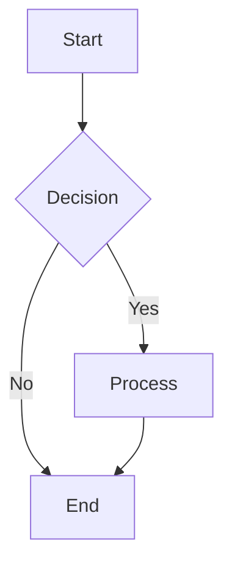

# Mermaid Diagram Guide

This guide explains how to create, convert, and use Mermaid diagrams in your documentation.

## What is Mermaid?

Mermaid is a JavaScript-based diagramming and charting tool that renders Markdown-inspired text definitions to create and modify diagrams dynamically. It's particularly useful for creating:

- Flowcharts
- Sequence diagrams
- Gantt charts
- Class diagrams
- State diagrams
- Entity Relationship diagrams
- and more

## Creating Mermaid Diagrams

1. Create a `.mermaid` file with your diagram code, like our `memory-bank-diagram.mermaid`
2. Use the Mermaid syntax to define your diagram

Example Mermaid syntax (flowchart):


## Converting Mermaid to Images

There are several ways to convert Mermaid diagrams to image formats:

### Option 1: GitHub's Built-in Mermaid Support

If you're hosting your repository on GitHub, you can use GitHub's built-in Mermaid rendering:

1. Keep your `.mermaid` file in your repository
2. Reference it in Markdown using the Mermaid code fence:

```markdown


GitHub will automatically render this as an image when viewing the Markdown file.

### Option 2: Mermaid Live Editor

For one-off conversions:

1. Go to [Mermaid Live Editor](https://mermaid.live/)
2. Paste your Mermaid code
3. Click on "Export" in the top menu
4. Select "PNG" or "SVG"
5. Download the image
6. Add the image to your repository

### Option 3: Using mermaid-cli (Command Line)

For automated conversions:

1. Install mermaid-cli:
```bash
npm install -g @mermaid-js/mermaid-cli
```

2. Generate the image:
```bash
mmdc -i images/memory-bank-diagram.mermaid -o images/memory-bank-diagram.png -b transparent
```

Parameters:
- `-i`: Input file path
- `-o`: Output file path
- `-b`: Background color (transparent, white, etc.)

### Option 4: GitHub Actions Automation

You can automate diagram generation with a GitHub Action:

1. Create a `.github/workflows/mermaid-render.yml` file:

```yaml
name: Render Mermaid

on:
  push:
    paths:
      - '**/*.mermaid'
      - '**/*.md'

jobs:
  build:
    runs-on: ubuntu-latest
    steps:
      - uses: actions/checkout@v2
      - name: Setup Node.js
        uses: actions/setup-node@v2
        with:
          node-version: '16'
      - name: Install dependencies
        run: npm install -g @mermaid-js/mermaid-cli
      - name: Render diagrams
        run: |
          mmdc -i images/memory-bank-diagram.mermaid -o images/memory-bank-diagram.png -b transparent
      - name: Commit rendered diagrams
        run: |
          git config --local user.email "action@github.com"
          git config --local user.name "GitHub Action"
          git add images/memory-bank-diagram.png
          git commit -m "Render Mermaid diagrams" || echo "No changes to commit"
          git push
```

This will automatically generate PNG files from your Mermaid files when you push changes.

## Using Mermaid Images in README

After creating the image, reference it in your README:

```markdown

```

## Updating Diagrams

When you need to update a diagram:

1. Modify the `.mermaid` file
2. Re-generate the image using any of the methods above
3. If you're using GitHub Actions, the image will update automatically

## Tips for Better Diagrams

1. **Use consistent styling**: Define classes for node types to maintain visual consistency
2. **Add color coding**: Use colors to indicate different types of processes or states
3. **Keep it readable**: Don't overcrowd diagrams; split complex ones into multiple simpler diagrams
4. **Add descriptive text**: Use labels on connections to clearly show relationships
5. **Use subgraphs**: Group related elements to improve organization

## Troubleshooting

- **Syntax errors**: Use the Mermaid Live Editor to validate your syntax before converting
- **Rendering issues**: Try different output formats (SVG vs PNG) if you encounter rendering problems
- **Size issues**: Adjust the scaling with the `-s` parameter in mermaid-cli (e.g., `-s 1.5` for 150% scale)

## Resources

- [Mermaid Official Documentation](https://mermaid-js.github.io/mermaid/#/)
- [Mermaid Live Editor](https://mermaid.live/)
- [Mermaid CLI GitHub Repository](https://github.com/mermaid-js/mermaid-cli)
- [GitHub Mermaid Support Documentation](https://docs.github.com/en/get-started/writing-on-github/working-with-advanced-formatting/creating-diagrams) 