# CURRENT SYSTEM STATE

> **TL;DR:** The Memory Bank System has evolved into a token-optimized, hierarchical framework with just-in-time rule loading, progressive documentation, and efficient context preservation across mode transitions.

## 🎯 CORE SYSTEM OPTIMIZATIONS

### 1. Hierarchical Rule Loading
- Just-In-Time (JIT) loading of specialized rules
- Core rule caching across mode transitions
- Complexity-based rule selection
- Significant reduction in token usage

### 2. Progressive Documentation

```mermaid
graph TD
    Start["Creative Phase<br>Initiation"] --> P1["1️⃣ PROBLEM<br>Define scope"]
    P1 --> P2["2️⃣ OPTIONS<br>List alternatives"]
    P2 --> P3["3️⃣ ANALYSIS<br>Compare options"]
    P3 --> P4["4️⃣ DECISION<br>Select approach"]
    P4 --> P5["5️⃣ GUIDELINES<br>Document implementation"]
    
    P3 -.->|"On Demand"| Details["Detailed Option<br>Analysis"]
    
    style Start fill:#d971ff,stroke:#a33bc2,color:white
    style P1 fill:#4da6ff,stroke:#0066cc,color:white
    style P2 fill:#ffa64d,stroke:#cc7a30,color:white
    style P3 fill:#4dbb5f,stroke:#36873f,color:white
    style P4 fill:#d94dbb,stroke:#a3378a,color:white
    style P5 fill:#4dbbbb,stroke:#368787,color:white
    style Details fill:#e699d9,stroke:#d94dbb,color:white,stroke-dasharray: 5 5
```

### 3. Optimized Mode Transitions
- Unified context transfer protocol
- Standardized transition documents
- Selective context preservation
- Improved context retention between modes

### 4. Enhanced Level Workflows
- Level 1: Ultra-compact templates for quick fixes
- Level 2: Balanced 4-phase workflow with simplified templates
- Level 3: Optimized creative phase exploration
- Level 4: Tiered documentation templates for enterprise projects

### 5. Token-Optimized Architecture

## 🔄 OPTIMIZATION EFFICIENCY

### Mode-Specific Optimizations
1. **VAN Mode**
   - Efficient complexity determination with minimal overhead
   - Platform-aware commands with reduced token usage
   - Streamlined file verification processes

2. **PLAN Mode**
   - Complexity-appropriate planning templates
   - Progressive disclosure of planning details
   - Tabular format for task organization

3. **CREATIVE Mode**
   - Progressive documentation with tabular comparisons
   - "Detail-on-demand" approach for creative exploration
   - Efficient option analysis templates

4. **IMPLEMENT Mode**
   - Streamlined implementation guidance
   - Level-appropriate verification processes
   - Consolidated status tracking

5. **REFLECT/ARCHIVE Modes**
   - Context-aware review mechanisms
   - Efficient knowledge preservation
   - Optimized documentation formats

### Context Management Improvements
- Unified context transfer protocol between modes
- Selective preservation of critical information
- Differential memory bank updates to minimize token usage
- Mode-specific context compression techniques

## 📊 TOKEN EFFICIENCY IMPROVEMENTS

### Rule Loading Optimization
- Hierarchical rule structure for efficient navigation
- Rule dependency tracking to prevent redundant loading
- Conditional rule loading based on complexity level
- Rule caching across mode transitions

### Documentation Efficiency
- Progressive disclosure model for complex documentation
- Tabular formats for efficient option comparison
- Level-appropriate documentation scaling
- Standardized templates with minimal boilerplate

### Memory Bank Optimization
- Differential updates to minimize token usage
- Context compression for frequently accessed information
- Selective synchronization across modes
- Structured knowledge organization

## 🎯 CURRENT FOCUS

1. **Architecture Refinement**
   - Fine-tuning the hierarchical rule loading system
   - Optimizing rule dependencies and relationships
   - Enhancing the adaptive complexity model

2. **Documentation Enhancement**
   - Further template optimization for each level
   - Improving tabular comparison formats
   - Refining progressive documentation approaches

3. **Context Preservation**
   - Enhancing the unified context transfer protocol
   - Improving transition document efficiency
   - Developing better context pruning algorithms

4. **Integration Enhancement**
   - Strengthening coordination between optimization components
   - Improving monitoring and metrics for optimization
   - Developing more sophisticated configuration options

## 🚀 NEXT STEPS

1. **Advanced Token Optimization**
   - Dynamic template generation based on task characteristics
   - Automatic context summarization for long-running tasks
   - Partial rule loading within specialized rule files

2. **Cross-Task Learning**
   - Knowledge preservation between similar tasks
   - Common solution patterns repository
   - Intelligent suggestion system based on historical decisions

3. **Workflow Automation**
   - Automated mode transitions based on task state
   - Intelligent rule selection based on usage patterns
   - Dynamic complexity adjustment during workflow

4. **Interface Enhancement**
   - Improved visual process maps with interactive elements
   - Better progress tracking and visualization
   - Enhanced transition guidance between modes

The system has been significantly optimized for token efficiency while maintaining all the structured development benefits of the original approach. These optimizations enable more complex projects to be handled effectively within token constraints while providing an improved user experience.